## 공지사항 웹 어플리케이션 구현

> 본 프로젝트는 특정 기업의 과제전형 제출을 위해 제작되었습니다.


해당 프로젝트의 DB는 H2를 사용하였으며, 파일 저장 구조 또한 temp directory를 사용해, 프로세스가 종료되면서 temp directory도 함께 지워지게 만들었습니다.


***요구 기능 사항***

* 사용자는 텍스트로 된 공지를 추가할 수 있다.
* 사용자는 공지를 수정/삭제 할 수 있다.
* 사용자는 공지 목록을 조회할 수 있다.
* 조회 시 제목, 작성일, 작성자, 최종 수정일, 내용이 조회 가능하다.
* 목록은 페이징 기능이 있다.
* 공지 등록시 여러개의 첨부 파일을 등록 할 수 있다(선택)

---

**프로젝트 Dependency**

1. Spring Security 

   용도 : 로그인, 회원가입

2. Spring Data JPA(Hibernate)

   용도 : RDB 객체 구현

3. Spring Web

   용도 : Client와의 Endpoint 및 Front 제공

프로젝트 구조는 아래와 같이 멀티모듈 구조로 구성했습니다.

```shell
Root project 'board'
+--- Project ':api'
\--- Project ':common'
```

`common` - Data 통신, 공통 모듈(Jpa)

`api` - Client와의 엔드포인트(front)

---

### Build & Run

**빌드**

Window

```shell
gradlew clean build
```

Another OS

```shell
gradle clean build
```

**실행**

Window

```shell
gradlew api:bootRun --args='--spring.profiles.active=local'
```

Another OS

```shell
gradle api:bootRun --args='--spring.profiles.active=local'
```

`Profile`을  굳이 세팅하고 실행하는 이유는, 테스팅을 위해 간단한 데이터를 `Initialize` 하는 `Contruct`가 `local` `Profile`에서만 실행됩니다.

**접속**

```shell
http://localhost:8080/
```

`local`로 세팅하여 실행 할 경우, `jhchoi950707@gmail.com` / `3145` 의 기본 계정이 생성되며, 접속시 기본적인 게시글이 등록되어 있습니다.

---

### 기능 구성


1. 로그인

   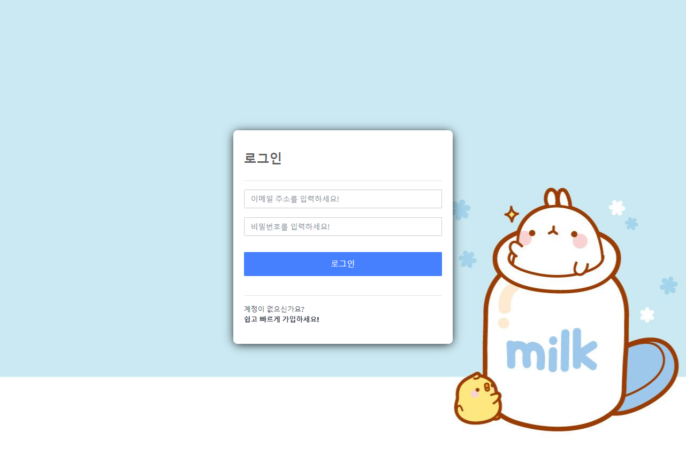

   실행 후, 접속하면 다음과 같이, 로그인 창이 맞아 주게 될겁니다. local 프로필로 실행하셨다면, 

   jhchoi950707@gmail.com / 3145 라는 계정이 기본적으로 생성됩니다.

2. 회원가입

   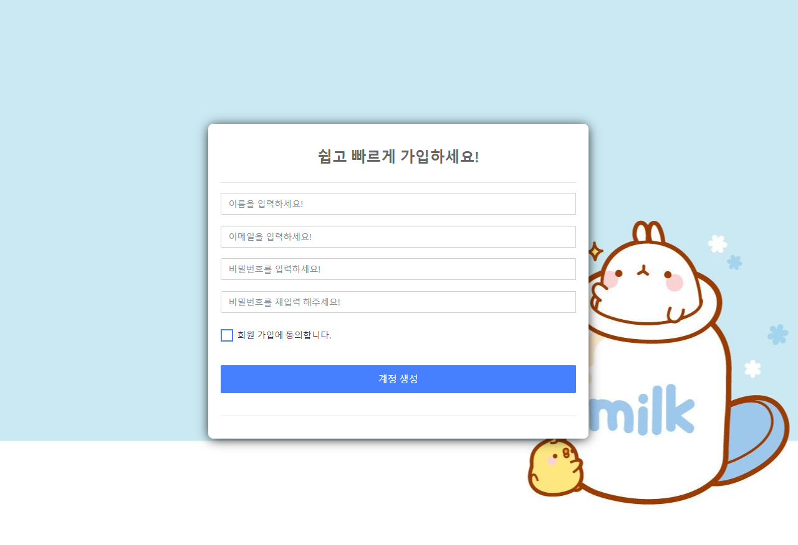

   간단한 정보로 회원가입을 가능케 했습니다. 이름과 이메일, 비밀번호만을 갖고, 별도의 인증 시스템이나, 서드파티 로그인 연동은 구현되지 않았습니다.

3. 게시글 조회 (Paigination)

   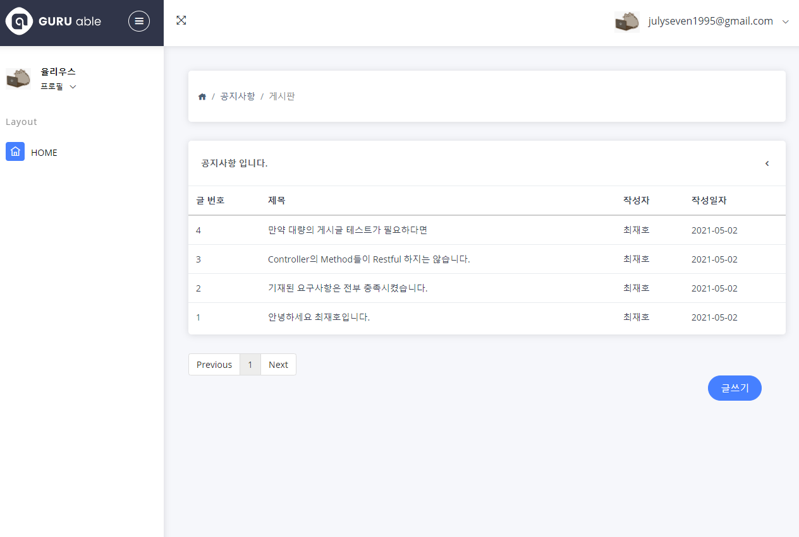

   접속하면, 게시글들을 볼 수 있는 게시판으로 이동합니다. 페이징 기능이 구현되어 있으며, 검색 기능은 구현되지 않았습니다. 하단의 글쓰기 버튼을 통해 게시글을 작성 할 수 있습니다.

   

   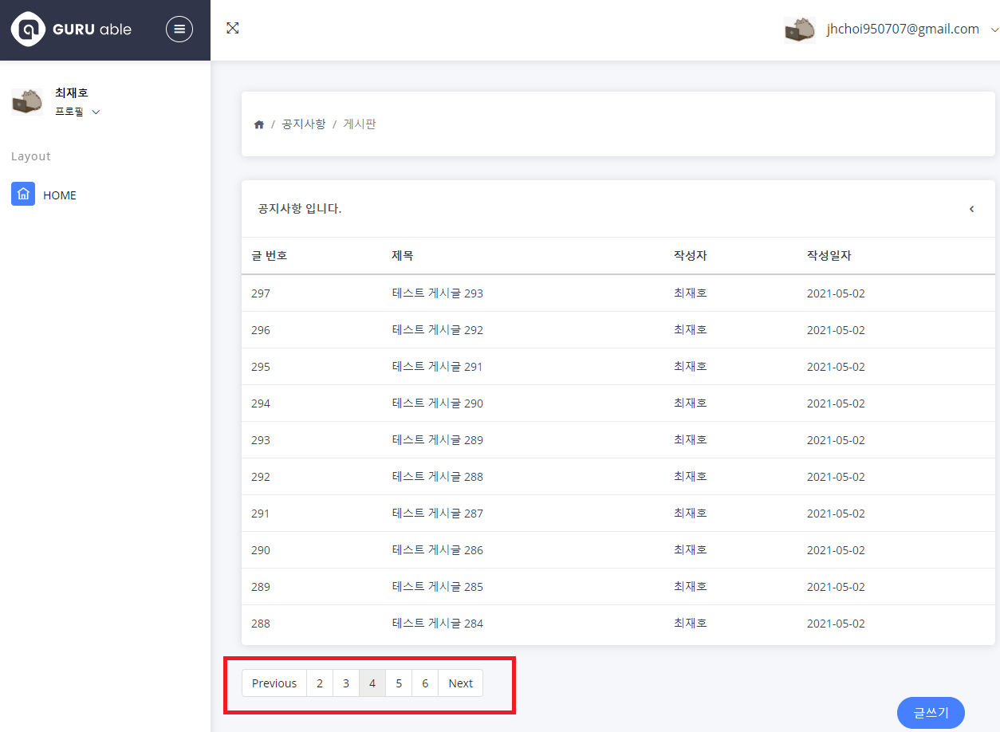

   페이징 기능 또한 구현되어있으며, 한 페이지에 출력되는 게시글의 최대 수는 10개입니다.

   

4. 게시글 작성

   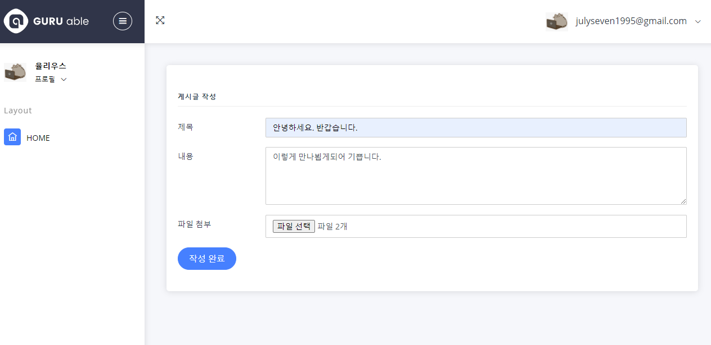

   게시글은 제목,내용을 입력할 수 있으며, 여러개의 파일을 첨부 할 수 있습니다.

   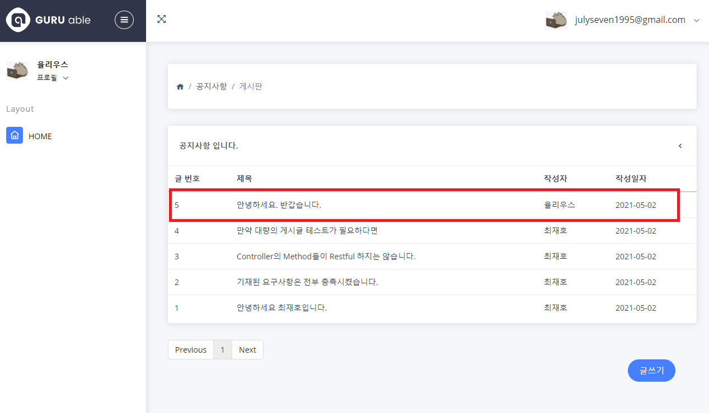

   위와 같이, 게시글이 등록되면 최신순으로 떨어지게 됩니다.

5. 게시글 조회

   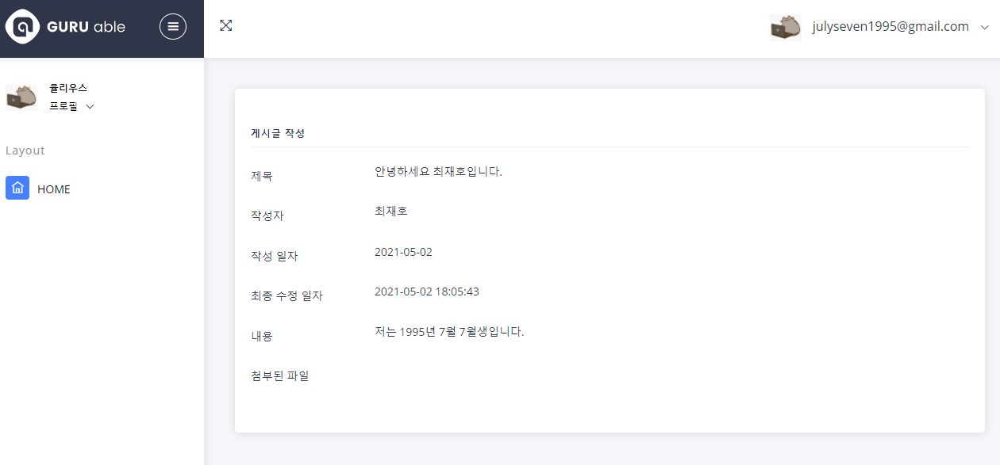

   게시판에서 게시글을 누르면, 게시글에 대한 상세한 내용을 확인 할 수 있습니다.

   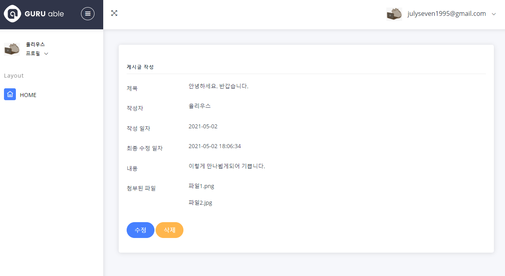

   자신이 작성한 글은 수정과 삭제가 가능합니다. 파일 다운로드 기능 또한 존재합니다.

6. 게시글 수정

   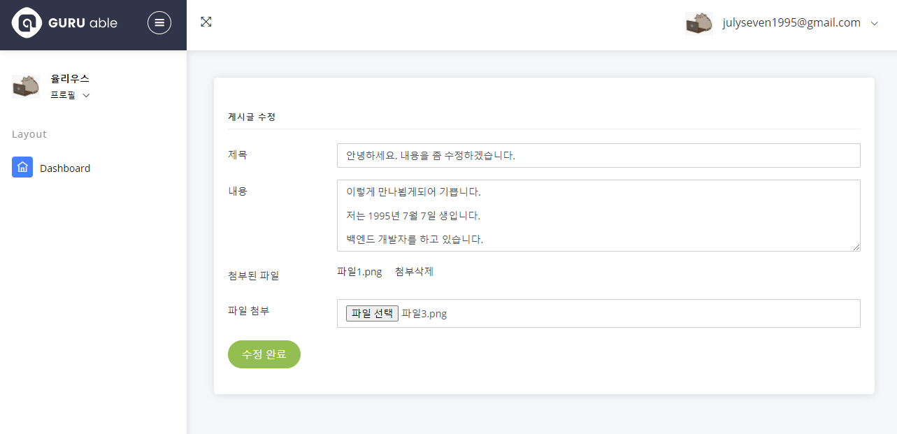

   다음과 같이 게시글의 수정이 가능하며, 첨부한 파일은 삭제할 수도 있고, 새로이 추가도 가능합니다.

   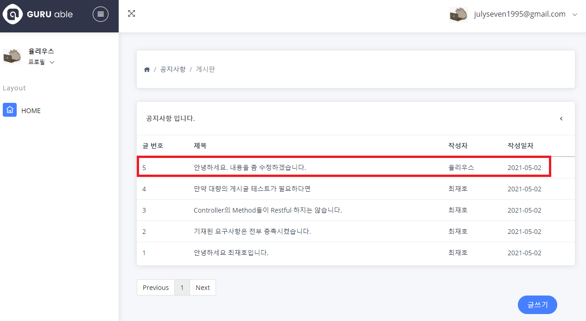

   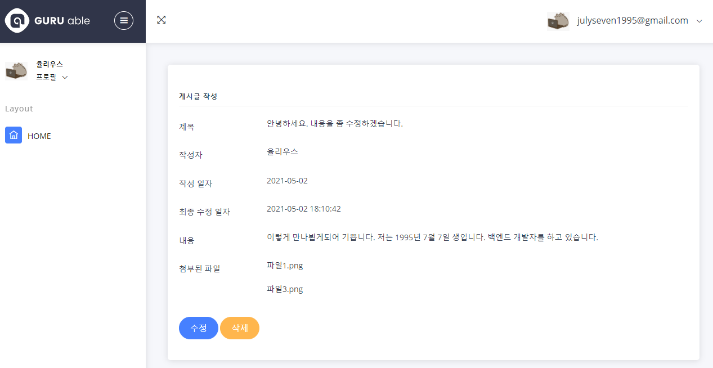

   

7. 게시글 삭제

   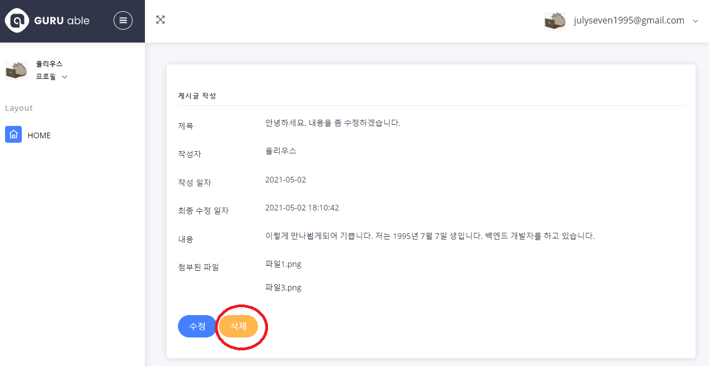

   자신이 작성한 글은 삭제가 가능합니다.

   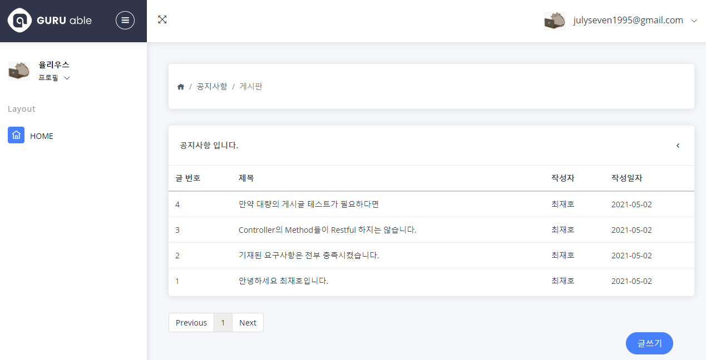

   

8. 로그아웃

   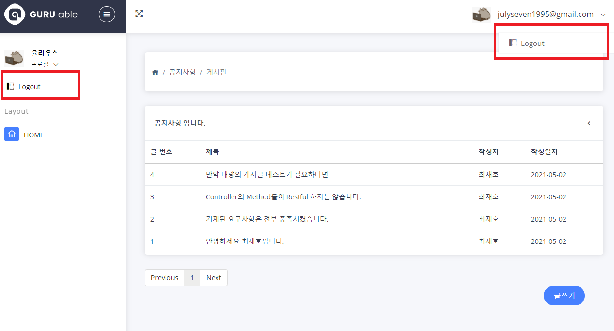

   메뉴에서 로그아웃 버튼을 누르게되면, 로그아웃이 됩니다.